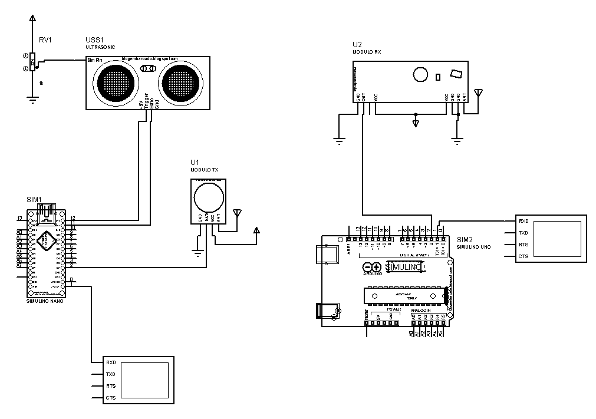

# medidor_volume
## Sistema para medição de volume container de resíduos sólidos

Projeto realizado na disciplina Engenharia Unifica II UFABC

* Sensor UltrassÔnico HC-SR04
* Módulo RR3 e RT4 433,92 MHz
* Arduino Nano
* Arduino Uno

